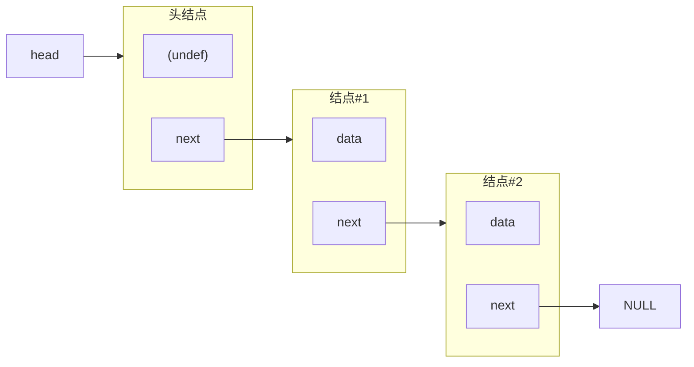
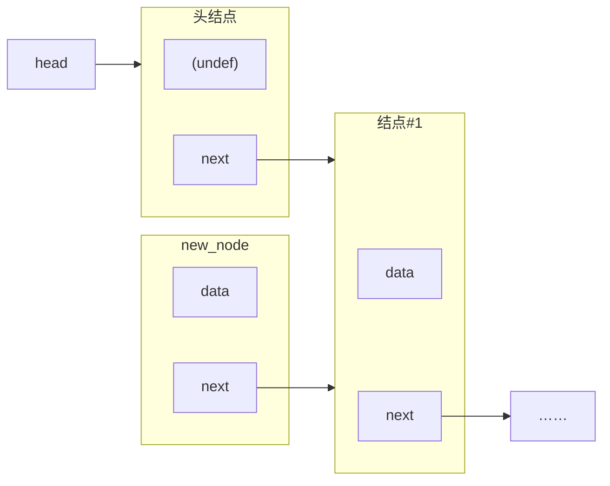
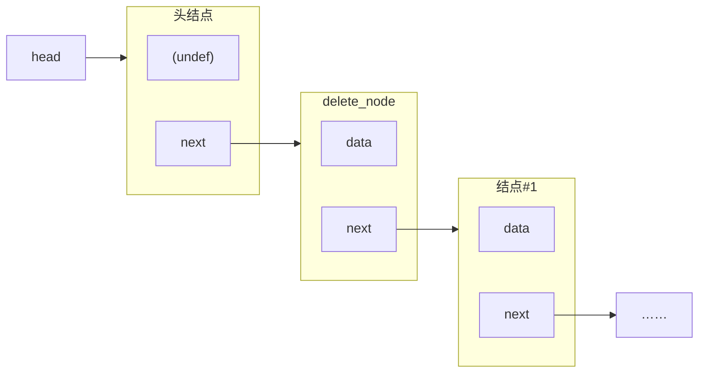
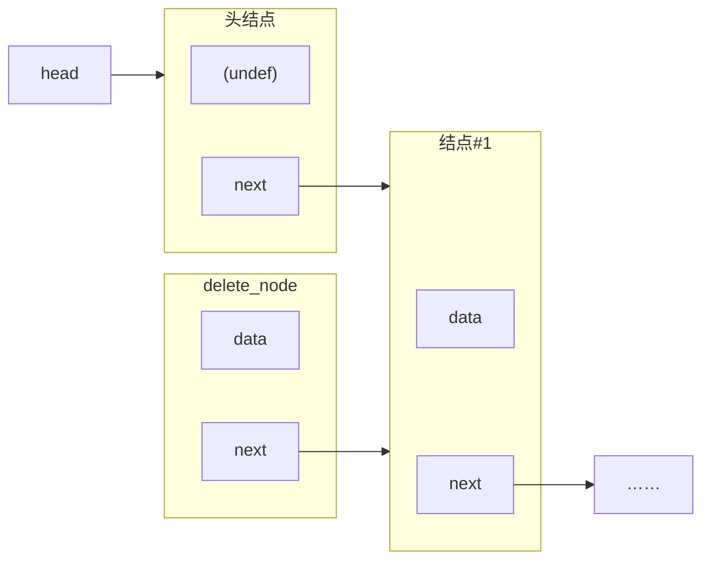

# 串讲

> 文件名带“test”的`*.c`文件是准备讲稿时测试用的，并不出现在幻灯片中。
>
> `demo.c`在幻灯片里出现了，但它们只是截屏（直接粘贴则格式易乱）用的草稿本——往往是特别短小的程序，或是其它程序的删节版。

程序编写、调试时编码都是 UTF-8。为了方便用 Dev-C++ 的同学，最后导出了 GBK 版本，即各种`*-gbk.c`。

## 结构体

> 2021年6月7日。

### 基础

结构体（对象）像数据的容器。

定义结构体<u>类型</u>`struct Complex {...};` ，声明<u>对象</u>`struct Complex z;`。

为了每次少写点儿东西，配合使用`typedef`。

> C语言是例外——C++等都不需要这种累赘。

【幻灯片】`1_basics.c`。

占多少内存？取决于编译器。

### 访问属性

`z.re`或`p->im`。

【幻灯片】`2-function.c`。

> 属性名不会和变量名重复。

### 其他

结构体可作为数组的元素，结构体的属性也可以是数组；……

## 文件

> 2021年6月6日、2021年6月7日。

### 打开

`fopen(<文件名>, <模式>) -> <文件指针>`

> `FILE* fopen(const char* filename, const char* mode)`

文件名：

- 路径

  若与`*.exe`在同一文件夹，可省略；不然必须写。

  > 准确来说，应该是文件在“当前工作目录”（cwd，current working directory）时可省略。
  >
  > 绝对路径（例：`D:/some_folder/sub_folder/file.txt`）和相对路径（例：`../sub_folder/file.txt`）都行。

  反斜杠需要转义（可写`"folder/file.txt"`或`"folder\\file.txt"`，不能写`"folder\file.txt"`）。

- 文件（主）名

- 扩展名/后缀

模式：

- 标准模式：<存在文件时>；<不存在文件时>
  - <u>r</u>ead：指向开头；返回`NULL`。

  - <u>w</u>rite：删除已有内容，指向结尾；新建。

  - <u>a</u>ppend：保留已有内容，指向结尾；新建。

    > 此模式无法修改已有内容（即使`rewind()`），但可读取已有内容。

- 扩展模式（`+`）：同时允许读写。

- 二进制模式（`b`）

> `+`和`b`可交换，例如`w+b`和`wb+`表示同一模式。

文件指针`fp`：

- 指向一个`FILE`结构体的指针。

  内部细节取决于编译器，我们只要知道它代表这个文件即可。

### 关闭

> 类似`malloc()`与`free()`。

`fclose(fp)`。

> 其实有返回值，正常时返回`0`，异常时返回`EOF`。不过即使异常，文件指针也不能用了，我们基本处理不了，所以大家好像都忽略返回值。

【幻灯片】`1_basics.c`。

### 操作

> 都在`stdio.h`中。

文件模型和`stdin`（黑框）类似。有一个线型的“纸带”，上面有个“读写头”指着它，读写时会自动移动它。

【幻灯片】图灵机。

#### 读写

- 通用

  如果你会用`scanf(...)`、`printf(...)`，那么你也会用`fscanf(fp, ...)`、`fprintf(fp, ...)`。

  > 字符串也有类似的`sscanf()`、`sprintf()`。

- 字符

  与`getchar()`对应的`fgetc(fp)`，与`putchar(ch)`对应的`fputc(ch, fp)`。

  > `fgetc()`不能用`unsigned char`接收，不然处理`EOF`会有问题；用一般的`char`或`signed char`可以。

- 字符串

  `fgets(str, count, fp)`与`gets(str)`对应，但需要告知`str`的长度的上界 ；`fputs(str, fp)`与`puts(str)`对应，但不会自动换行。

  > `fgets(str, count, fp)`与`gets_s(str, count)`更像。后者是 C11 引入的；另外，C11 以后（不含 C11）的 C 移除了 `gets()`。

> 注意，`fp`是各种读写函数的最后一个参数——除了`fscanf()`、`fprintf()`。因为它们俩的参数可以很多很多，所以只好放在第一个参数。
>
> 当然，如果不小心忘了，还可以问编译器：
>
> 

> 二进制文件一般使用`fread(buffer, size_per_element, count, fp)`、`fwrite(buffer, size_per_element, count, fp)`读写。

【幻灯片】`2_read_and_write.c`。

#### 移动“读写头”

- `rewind(fp)`

  回到开头。

  > rewind 有倒带的意思，复读常用这个方法。

- `fseek(fp, shift, origin) -> int`

  将“读写头”移动到任意位置，这个位置由`shift`和`origin`描述。

  `origin`是文件开头（`SEEK_SET`）、结尾（`SEEK_END`）或当前位置（`SEEK_CUR`）。

  > `SEEK_END`是文件最后一个字节的下一字节，一般`(-1, SEEK_END)`是文件的最后一个字节。

  `shift`是目标位置相对`origin`的偏移量。二进制模式下，偏移量用字节数表示（有正负）；文本模式下，文件结尾、当前位置的偏移量只允许是零，文件开头的偏移量只允许是`ftell()`的返回值。

  `fseek(fp, 0, SEEK_SET);`等价于`rewind(fp);`。
  
  返回零代表成功，非零代表失败。
  
- `ftell(fp) -> long`

  返回当前“读写头”位置。

  二进制模式下，这用自文件开头的字节数表示；文本模式下，不同编译器的定义可能不同。

  无论什么模式，`fseek(fp, ftell(fp), SEEK_SET)`总是把“读写头”移动到当前位置（即不移动）。

【幻灯片】`4_tell_and_seek.c`。

#### 其它

错误处理：`ferror(fp)`。

对文件本身（而非内容）的操作：`remove(filename)`、`rename(old_name, new_name)`。

## 链表

> 2021年6月7日、2021年6月8日。

类比定向越野。

优点：动态。

缺点：需要专门的内存来存储“关系”。

【幻灯片】`1_all_in_one.c`。

---

- 抓住主要矛盾。
- 从联系的观点看问题。
- 全面考虑极端情况。

### 建立空链表

### 遍历

先保证每多一个结点就多一次循环。

### 添加结点

新结点的所有属性都需要重新设置：

修改相关结点的属性：

### 删除结点

修改相关结点的属性：

删除结点：

