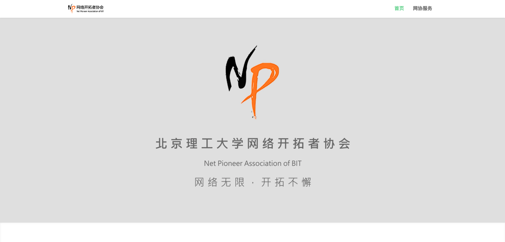

## 网络开拓者协会 - 全体大会


```yaml
info:
  author: fky
  date: "2018-11-04"
  description: 关于网协
```


## 所以要说些什么

- 关于咱们的*定位*
- 关于咱们的*活动*
- 关于咱们的*项目*


## 一切都是因为好奇

<small>一群人因为兴趣而聚集在了一起</small>
<!-- 希望继续保持下去 -->


## 能够 & 不能够 带来什么

修行在个人


## 也会疲倦吧

我是谁
我在哪儿
我干嘛来了


尽吾志也而不能至者
## 可以无悔矣


## 我们的活动

- 培训
- 开会
- 诊所
- 直播
- 串讲
- 推送
- 开发
- 水群
- 


## 算是工作计划？


## 网站资源整合


`bitnp.net`



`live.bitnp.net`


`mirrors.bit.edu.cn`
北理开源镜像站


`design.bitnp.net`
设计语言相关


`schedule.bitnp.net`

- 甚至加上大佬们的博客


`clinic.bitnp.net`
诊所预约系统
under dev


`blog.bitnp.net`
播客服务


## 其他服务


## 直播
提高工作效率


## 电脑诊所


## 校园网网络环境周报


## 镜像站


## gitlab


## wiki.bitnp.net


## acm.bitnp.net


## zzxx.bitnp.net


## 校园网相关开发


## 继续挖坑


## 讲座
- 分`基础`和`进阶`类型


## 属于网协的设计语言
- logo
    - 使用方式 
- 配色方案
    - 使用方式
- 布局


## 优化招新方式


## 申请办公室（星星眼）


## 多举办非技术类活动


## 技术类讲座
- 面向全校
- 类似TED


## 这么硬核!? 溜了溜了


## 就酱

<small>thanks</small>